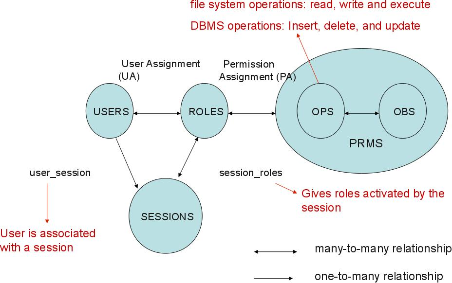
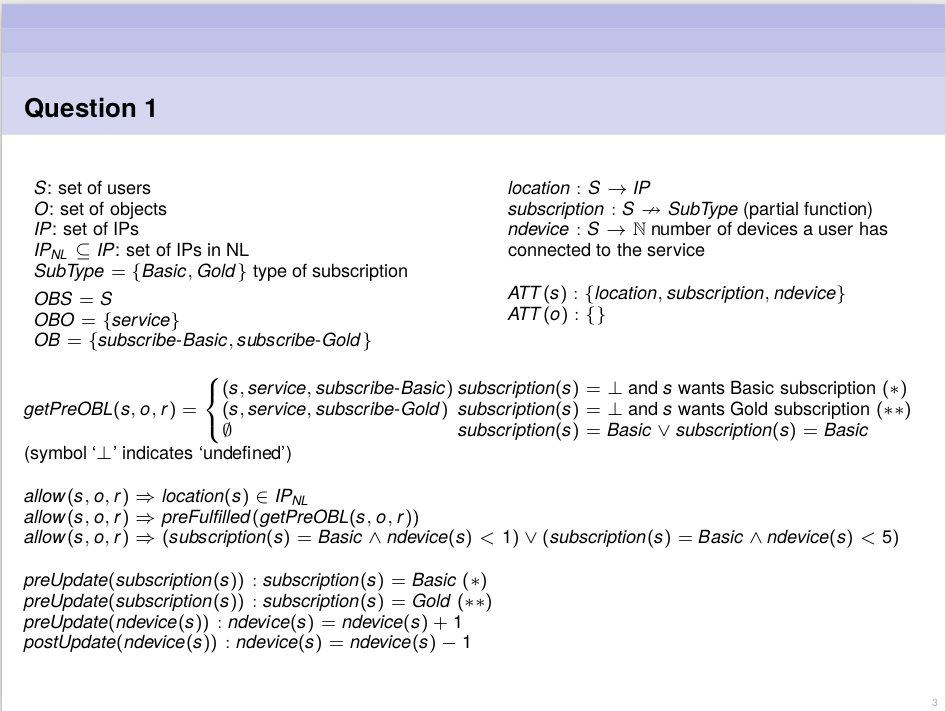
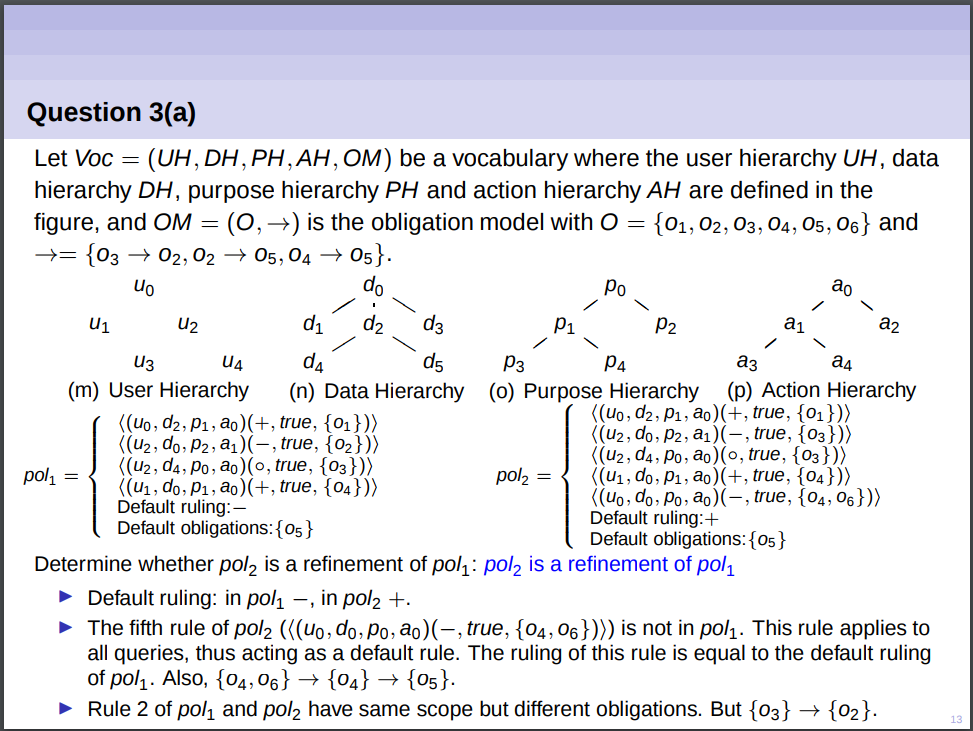
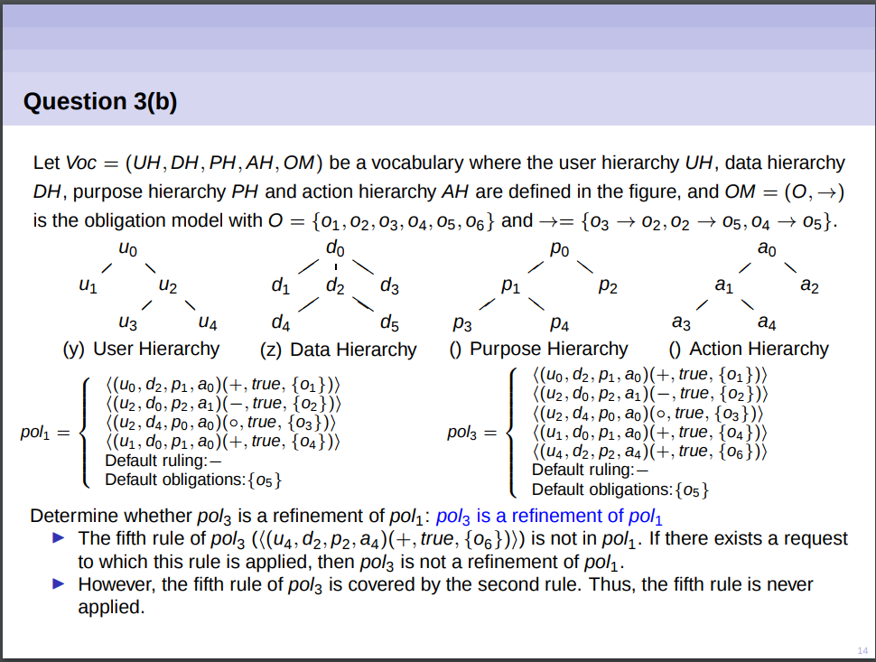
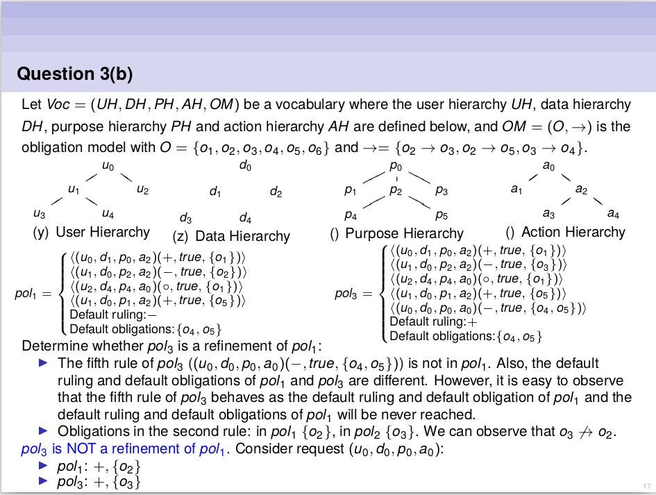
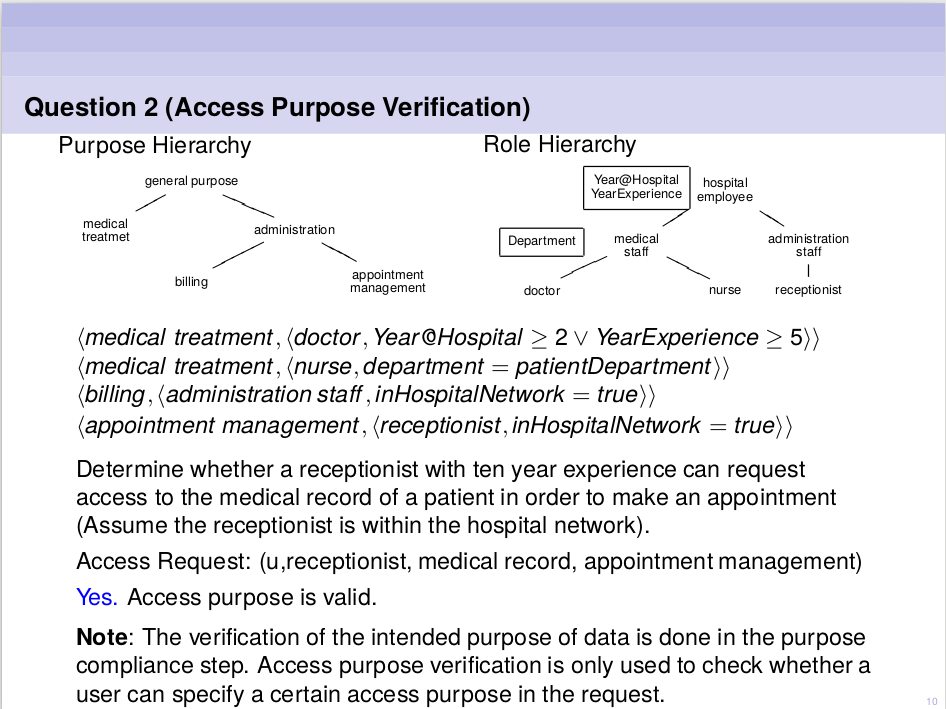

# Overview

- Access control
  - Discretionary access control (DAC) $\rightarrow$ HRU
  - Mandatory access control (MAC) $\rightarrow$ BLP, Biba, Chinese Wall
  - Role based access control (RBAC) $\rightarrow$ RBAC$_0$,  RBAC$_1$,  RBAC$_2$,  RBAC$_3$
  - Attribute-based (ABAC)
- Usage control (UCON)
- Privacy-aware access control
- XACML

# HRU

| Operation (op)            | Conditions                    |
| ------------------------- | ----------------------------- |
| create subject s'         | $s' \not \in O $              |
| create object $o'$        | $o' \not \in O$               |
| enter $r$ into $A[s,o]$   | $s \in S$ and $o \in O$       |
| delete $r$ from $A[s, o]$ | $s \in S$ and $o \in O$       |
| destroy subject $s'$      | $s' \in S$                    |
| destroy object $o'$       | $o' \in O$ and $o \not \in S$ |

| Command                              |                                          |
| ------------------------------------ | ---------------------------------------- |
| $CREATE(s,o)$                        | create object $o$ and enter $own$ into $A[s, o]$ |
| $CONFER_{read}(s_1, s_2, o)$         | if $own$ in $A[s_1, o]$ then enter $read$ into $A[s_2, o]$ |
| $REVOKE_{read}(s_1, s_2, o)$         | if $own$ in $A[s_1, o]$ then delete $read$ from $A[s]$ |
| $TRANSFER_{read}(s_1, s_2, o)$       | if $*read$ in $A[s_1, o]$ then enter $read$ into $A[s_2, o]$ |
| $TRANSFER\_ONLY_{read}(s_1, s_2, o)$ | if $+read$ in $A[s_1, o]$ then delete $+read$ from $A[s_1, o]$ and enter $+read$ into $A[s_2, o]$. |

- **copy flag (*):** subject can transfer privilege to others

- **transfer-only flag (+):**  subject can transfer privilege to others, but he loses the privilege

- **safety property:** the program will never produce a wrong result (partial correctness)

- **liveness property:** the program will produce a result

- A state **leaks** a right $r$ if there is a command $c$ that enters $r$ into a position of the access matrix that previously did not contain $r$.

- A state is **secure** with respect to a right $r$ if no sequence of commands can transform the access matrix into a state that leaks $r$.

# Multi-level security

- **Security level (L or $\lambda$):** elements of a hierarchical set (e.g. TopSecret, Secret, Confidential, Unclassified)
  - Each subject $S$ has a maximal security class $\lambda_m(S)$ and a current security class $\lambda_C(S)$ such that $\lambda_c(S) \leq \lambda_m(S)$
- **Categories (C):** elements of non hierarchical set (e.g. administrative, financial)
  - Defines the area o f competence of users and objects
- **Dominance ($\succeq$):** $(L_1, C_1)  \succeq (L_2, C_2) \implies L_1 \geq L_2 \wedge C_1 \supseteq C_2$ 
- Security classes together with dominance relation introduce a lattice (SC, $\succeq$):
  - **Reflexivity**: $\forall_{x \in SC}(x \succeq x)$
  - **Transitivity**: $\forall_{x, y, z \in SC}(x \succeq y \wedge y \succeq z \implies x \succeq z)$ 
  - **Antisymmetry:** $\forall_{x, y \in SC}(x \succeq y \wedge y \succeq x \implies x = y)$
  - **Least upper bound (lub):** for any $x$ and $y$, the node $z$ that is immediately above
  - **Greatest lower bound (glb):** for any $x$ and $y$, the node $z$ that is immediately below
- __Strong tranquility property:__ Subjects and objects do not change labels during the lifetime of the system
- __Weak tranquility property:__ Subjects and objects do not change labels in a way that violates the "spirit" of the security policy

#### Bell-laPadula (BLP) model

- Simple security property (**no read up**): $S$ can read $O$ $\iff$ $\lambda_c(S) \geq \lambda(O)$
- *-property (**no write down**): $S$ can write $O$ $\iff$ $\lambda_c(S) \leq \lambda(O)$
- Assumes _strong tranquility property_

#### Biba model

- Simple security property (**no read down**): $s$ can read $o$ $\iff$ $\lambda( o)\succeq \lambda(s)$
- *-property (**no write up**): $s$ can write $o$ $\iff$ $\lambda(s) \succeq \lambda(o)$
- Assumes _strong tranquility property_
- __low-water-mark for subjects__ relaxes the read by allowing subjects to read down
- __low-water-mark for objects__ relaxes the write by allowing subjects to write up 

#### Biba + BLP

- Security class of each object and subject consists of two labels
  - Secrecy labels $\lambda_s$
  - Integrity labels $\lambda_I$
- Combined access rules are
  - Subject $s$ can __read__ object $o$ $\iff$ $\lambda_s(s) \succeq \lambda_s(o) \wedge \lambda_I(s) \preceq \lambda_I(o)$
  - Subject $s$ can __write__ object $o$ $\iff$ $\lambda_s(s) \preceq \lambda_s(o) \wedge \lambda_I(s) \succeq \lambda_I(o)$

#### Chinese wall

- Prevent information flows that cause conflicts of interest
- Company information is organized hierarchically in 3 levels:

  - **basic objects** (e.g files)
  - **company datasets** (CDs): group objects referring to the same company
  - __conflict of interest classes__ (COI): groups all company datasets whose companies are in competition
- **Simple property**: subject $s$ can **read** object $o$ only if 

  - $o$ is in the same company dataset as all the objects that $s$ has already accessed within the same conflict of interest class (**history-based**) 
  - $o$ belongs to a different conflict of interest class.
- ***-property**: subject $s$ can **write** object $o$ only if 

  - access is permitted by the simple property
  - no object can be read by $s$ which is (I) in a different company dataset than the one for which write access is requested and (II) contains unsanitized information
- **Sanitization:** disguising corporate information, preventing the discovery of the identity of a company

# RBAC

#### Overview of Rule Based Access Control

- $RBAC_0$
  - Roles based on job functions
  - User assignment (UA) to roles 
  - Permissions assigned (PA) to rules
- $RBAC_1 = RBAC_0 + $ Role hierarchy (RH)
- $RBAC_2 = RBAC_0 + $ Constraints
- $RBAC_3 = RBAC_1 + RBAC_2$

#### RBAC$_0$: Core model - notation

- $U \rightarrow$ Users
- $R \rightarrow$ Roles
- $OPS \rightarrow$ Operations
- $OBS \rightarrow$ Objects
- $P \subseteq OPS \times OBS \rightarrow$ Permissions
- $SE \rightarrow$ Session
- $UA \subseteq U \times R \rightarrow$ User assignment
- $PA \subseteq P \times R \rightarrow$ Permission assignment

#### RBAC$_1$: Role Hierarchy

- $RH \rightarrow$ Role Hierarchy
- Some roles __subsume__ others: a GP can perform all actions that a physician can perform (plus other actions). Granting access to role $R$ implies that access is granted for all specialized roles of $R$.
- Sometimes the reversed role hierarchy is used: __dominance__ relation instead of __specialization__

#### RBAC$_2$: Constraints

- **Static Separation of Duty** (SSoD): restrict the permissions that can be <u>assigned</u> to a user
  - $ssod(ps, n) \rightarrow$ at least $n$ users are needed to cover all permissions in permission set $ps$ (with $|ps| \geq n$) 
- **Dynamic Separation of Duty** (DSoD): restrict the permissions that can be <u>exercised</u> by a user
  - Object based Separation of Duty: no user is allowed to perform all the actions in a business task on a collection of object(s)
  - History-based Separation of Duty: no user may act upon an object that she has previously acted upon
- **Static Mutually Exclusive Roles:** Static separation of duty. Restrictions on the roles that can be assigned to a user
  - $smer(rs, n) \rightarrow$ any user cannot be assigned to $n$ or more roles in role set $rs$
- **Dynamic Mutually Exclusive Roles:** Dynamic separation of duty. Restriction on the roles that a user can activate in a session
  - $dmer(rs, n) \rightarrow$ users cannot simultaneously activate $n$ or more roles from role set $rs$ in one session
- Other constraints
  - Cardinality constraints on User Assignment
    - E.g. at most $k$ users can belong to the role
  - Prerequisite roles
    - A user can only be assigned/activated to a particular role only if it is already assigned/activated to some other specified role.

#### RBAC$_2$ with Static Mutually Exclusive Roles

#### RBAC$_2$ with Dynamic Mutually Exclusive Roles

#### Example question

Define a RBAC3 system to regulate permissions within a bank branch. The system should implement
the following requirements:

1. A bank employee can be a clerk, a manager or the head of the bank branch
2. A bank branch can have only one head.
3. The head of the bank branch is a manager.
4. Bank employees can make loan offers to customers.
5. Loan offers should be reviewed by a different clerk or a manager before they can be approved.
6. If the amount of the loan offer is lower than $10K, the offer should be approved by a manager.
7. If the amount of the loan offers is equal or greater than $10K, the offer must be approved by two managers.

8. A bank employee cannot approve loan offers he made or reviewed.

#### Solution

Roles (R) = {employee, clerk, manager, head, offerer, reviewer, approver\_1, approver\_2}
Objects (OBS) = {loan$_{\geq 10K}$ , loan$_{< 10K}$ }
Operations (OPS) = {offer, review, approve}
Session (SE): A session is created when a loan request is received.

__Permission assignment__

| Role       | Permission                               |
| ---------- | ---------------------------------------- |
| Offerer    | (offerer, loan$_{\geq 10K}$), (offerer, loan$_{< 10K}$) |
| Reviewer   | (review, loan$_{\geq 10K}$), (review, loan$_{< 10K}$) |
| Approver_1 | (approve, loan$_{\geq 10K}$), (approve, loan$_{< 10K}$) |
| Approver_2 | (approve, loan$_{\geq 10K}$)             |

__Role hierarchy__

- Employee 
  - Clerk
  - Manager
    - Head

__Cardinality constraints__

- $|\{u|(u, head) \in UA\}| = 1$

__Prerequisite roles__

- $(u, offerer) \in Session_i \rightarrow (u, employee) \in Session_i$
- $(u, reviewer) \in Session_i \rightarrow (u, clerk) \in Session_i$
- $(u, reviewer) \in Session_i \rightarrow (u, manager) \in Session_i$
- $(u, approver\_1) \in Session_i \rightarrow (u, manager) \in Session_i$
- $(u, approver\_2) \in Session_i \rightarrow (u, manager) \in Session_i$

__Mutually exclusive roles__

- $dmer(\{offerer, reviewer\}, 2)$
- $dmer(\{offerer, reviewer, approver\_1, approver\_2\}, 2)$

## RT0 syntax

- A, B, D: principals
- r, r1, r2: role names
- A.r: a role (a principal + a role name)

Four types of credentials:

| Type                                     | Explanation                              |
| ---------------------------------------- | ---------------------------------------- |
| Type 1: A.r $\leftarrow$ D               | Role A.r contains principal D as a member |
| Type 2: A.r $\leftarrow$ B.r1            | A.r contains role B.r1 as a subset       |
| Type 3: A.r $\leftarrow$ A.r1.r2         | A.r $\supseteq$ B.r2 for each B in A.r1  |
| Type 4: A.r $\leftarrow$ A1.r1 $\cap$ A2.r2 | A.r contains the intersection            |

| Example                                  | semantics                                | definition                               |
| ---------------------------------------- | ---------------------------------------- | ---------------------------------------- |
| Epub.discount $\leftarrow$ Alice         | Alice $\in$ [[Epub.discount]]            | Alice belongs to the role Epu.discount   |
| Epub.discount $\leftarrow$ StateU.student | [[StateU.student]] $\subseteq$ [[Epub.discount]] | if StateU states that X is a student then I state that X gets a discount |
| Epub.discount $\leftarrow$ AccredBureau.university.student | For every $X \in$ [[AccredBureau.university]], [[X.student]] $\subseteq$ [[Epub.discount]] | If AccredBureau states that $X$ is an accredited university and  $X$ states that $Y$ is a student  then I state that $Y$ gets a discount |
| ITbizz.maysign $\leftarrow$ ITbizz.manager $\cap$ ITbizz.senior | [[ITbizz.manager]] $\cap$ [[ITbizz.senior]] $\subseteq$ [[ITbizz.maysign]] | Anyone showing a manager certificate and a senior certificate, both signed by ITbizz may sign |

#### Example question

Find the semantics.

- Alice.s $\leftarrow$ Alice.u.v
- Alice.u $\leftarrow$ Bob
- Bob.v $\leftarrow$ Charlie
- Bob.v $\leftarrow$ Charlie.s
- Charlie.s $\leftarrow$ David
- Charlie.s $\leftarrow$ Edward

#### Solution

-  [[Charlie.s]] = {David, Edward}
-  [[Bob.v]] = {Charlie, David, Edward}
-  [[Alice.u]] = {Bob}
-  [[Alice.s]] = {Charlie, David, Edward}

#UCON

- continuity of decisions
  - **pre-decision:** Decide approval or denial of request
  - __ongoing-decision:__ Revoke or continue to allow exercise of usage
- mutability of attributes
  - __pre-update:__ update before usage
  - __ongoing-update:__ update during usage
  - __post-update:__ update after usage

#### Example question (1)

Discuss the UCON model needed to specify a policy supporting the following scenario, and write the UCON policy in the identified model. A Dutch service provider offers pay-per-use services within the Netherlands. A user should be registered with the service provider in order to access a service. Registration is required when a user requests a service for the first time. Moreover, a user can access a service only if he has sufficient credit. The cost of the service is subtracted from the credit of the user after the usage of the service. There can be only 10 simultaneous usages of the same service.

Hint: Model registration to the service provider using obligations.

#### Solution (1)

#### Example question (2)

A content provider offers an on-demand media streaming service. To access the service, users should
subscribe to the service. The provider allows two types of subscription: Basic and Gold. Depending
on the type of subscription, users can simultaneously connect a different number of devices to the
provider’s library of online content. In particular, the Basic subscription allows a user to connect one
device whereas the Gold subscription allows a user to connect up to five devices. The service is offered
only within the Netherlands.

#### Solution (2)

Model: UCON$_{preA_{13}preB_1}$

- Pre Authorization (preA)
  - Access is only offered within the Netherlands
  - Constraint on the number of devices that a user can connect to
- Pre Obligation (preB)
  - Subscription to the service
- Update
  - Record whether a user is subscribed (and the type of subscription)
  - Record the number of devices currently connected

#### BLP-model in UCON

- $L$ lattice of security labels with dominance relation $\succeq$
- clearance: $S \rightarrow L$
- classification: $O \rightarrow L$
- $ATT(S) = \{clearance\}$
- $ATT(O) = \{classification\}$
- $allowed(s, o, read) \implies clearance(s) \succeq classification(o)$
- $allowed(s, o, write) \implies clearance(s) \preceq classification(o)$

# EPAL

#XACML

# Reduction

# Purpose based access control

